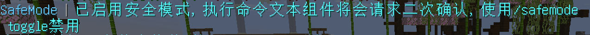
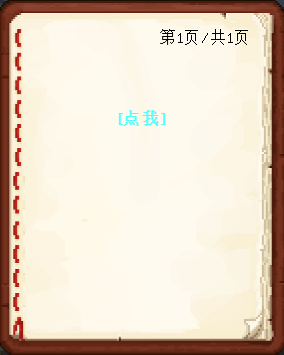
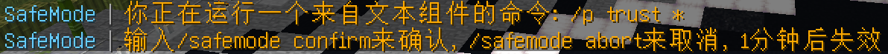

# 文本组件安全模式

这是一个用于保护玩家执行来自文本组件的命令(`run_command`)的功能。

某天你在服务器中收到了一本来源不明的书

你想点击那个`[点我]`看看到底会发生什么，但是害怕它会让你执行恶意命令。

有了这个功能，你只需要先执行`/safemode toggle`调整这个功能到启用状态，然后再点击它。

这果然是个恶意命令，会让你开放地皮权限给所有人！

接下来，你只需要点击`/safemode abort`就可以取消执行啦。